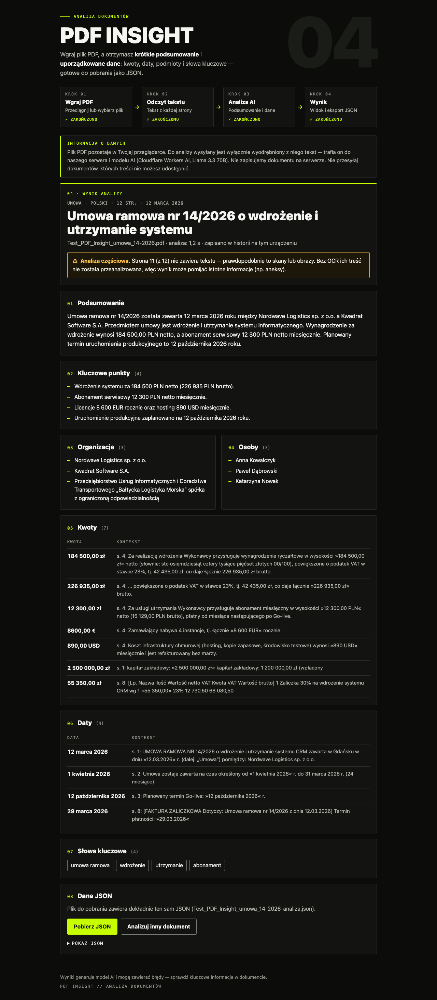

# PDF Insight

Upload a PDF, get a factual summary and structured data (document type, title, date, key points,
organizations, people, amounts, dates, keywords) as validated JSON you can download.

> **Status: Stage 1 MVP, not deployed.** No public demo URL exists yet, the AI path has not been
> run against live Workers AI, and the <30 s target is unmeasured. See
> [docs/STATUS.md](docs/STATUS.md) for what is implemented, tested and pending.

## Interface

Dark interface in the visual language of the recruitment brief (near-black panels, one lime
accent, numbered monospace labels), Polish UI, four-step indicator driven by the real flow state.
Screenshots below come from a **local stub with a hand-made fixture** (no live AI, not an analysis
result): [desktop](docs/screenshots/desktop-result.png), [mobile 360 px](docs/screenshots/mobile-result.png),
[idle](docs/screenshots/desktop-idle.png), [ready with a scanned page](docs/screenshots/mobile-ready.png).



## Architecture

```
Browser (GitHub Pages, React SPA)                Cloudflare Python Worker (FastAPI)
┌──────────────────────────────────┐   HTTPS    ┌─────────────────────────────────────────┐
│ PDF ≤10 MB stays in the browser  │  JSON:     │ entrypoint: bound body (≤256 KiB)       │
│ pdf.js → text per page           │  pages +   │ CORS allowlist → Rate Limiting bindings │
│ pages without text detected      │  metadata  │ Pydantic request validation             │
│ limits checked, nothing truncated│ ─────────► │ prompt (document = untrusted data)      │
│ Zod validates every response     │ ◄───────── │ env.AI.run(Llama 3.3 70B, JSON mode)    │
│ result view + JSON download      │  result    │ Pydantic output validation, 1 retry     │
│                                  │            │ AI_MODE=chunked (opt-in): overview +    │
│                                  │            │ ≤8 chunk calls, ≤2 in flight, merge     │
└──────────────────────────────────┘            └─────────────────────────────────────────┘
```

- **frontend/** — React 19, Vite, TypeScript strict. `src/components` (UI), `src/lib` (contract,
  extraction, validation, flow state), `src/api` (HTTP client).
- **backend/** — FastAPI on Cloudflare Python Workers (Pyodide). `src/worker.py` is the Workers
  entrypoint; `src/pdf_insight/` is plain FastAPI/Pydantic code that runs and is tested on CPython.
- **contracts/** — the API contract, ISO code lists, numeric limits and accepted/rejected fixtures
  shared by pytest and Vitest. Details: [contracts/README.md](contracts/README.md).

### Key decisions

| Topic | Decision |
|---|---|
| AI access | Workers AI **binding** (`env.AI`). There is no model API key anywhere — not in code, config, the browser or CI. |
| Model | `@cf/meta/llama-3.3-70b-instruct-fp8-fast` with `response_format: json_schema` (listed as supported in Cloudflare's JSON mode docs, 2026-10-05). Configurable via `AI_MODEL`. |
| Data flow | Only extracted text leaves the browser; the PDF itself does not. Nothing is stored server-side. The UI shows a Polish notice before the user starts the analysis. |
| Untrusted input | Page text is wrapped in `<document>/<page>` tags, tag names inside the text are neutralised, and the system prompt treats instructions inside the document as content. Results are rendered as text only (no `dangerouslySetInnerHTML`). |
| Ownership | `document.fileName` and `document.pages` come from the validated request, never from the model. |
| Validation | The raw model JSON is validated first (all requested keys present, strict types), then normalised and validated against the public contract: strict Pydantic (backend) and Zod (frontend) with unknown keys rejected; both run the same fixture files. Exactly one backend retry on invalid model output; the browser never retries on its own. |
| Summary length | 3–5 sentences checked with a conservative sentence-count interval that handles `sp. z o.o.`, `S.A.`, decimals and initials (see contracts/README.md). |
| Missing title | Deterministic neutral label in the document language (`Dokument bez tytułu`, `Untitled document`, …) with `analysis.titleFallback = true`. |
| Scans | Pages without a text layer are listed in `analysis.pagesWithoutText` and shown as a partial-analysis warning; a fully scanned PDF gets an actionable error. No OCR yet. |
| Analysis mode | `AI_MODE=compact` (experimental): code extracts candidate amounts/dates with source offsets, one model call selects their IDs, values and contexts are copied from the source (≤ 30 000 chars, ≤ 400 candidates); second trial 23.8 s with all automatic checks passed, but key points copied the summary, so it is still unaccepted (docs/LIVE_AI_RESULTS.md). `AI_MODE=single` (default): one model call, up to 48 000 chars of text. `AI_MODE=chunked` (experimental, F-08): overview call + one call per ≤ 10 000-char chunk (≤ 8), at most 2 in flight, one overall deadline, one retry per request, evidence-grounded deterministic merge, up to 64 000 chars. Not the default until compared on real AI — see [docs/CHUNKING.md](docs/CHUNKING.md). |
| Body limit | The Workers ASGI adapter buffers the body before FastAPI runs, so the entrypoint rebuilds **every** request first: only `POST /api/analyze` reads its body (rejected from an oversized declared `Content-Length` without reading, otherwise streamed and abandoned after `MAX_BODY_BYTES + 1` bytes); all other paths and methods are forwarded without a body. Middleware enforces the same policy again. |
| Rate limiting | Cloudflare Rate Limiting bindings: 5 req/60 s per client IP and 30 req/60 s global. Counters are per Cloudflare location and eventually consistent (documented by Cloudflare). In production the API fails closed (503) if a binding is missing or errors. |
| CORS | Origin allowlist from `ALLOWED_ORIGINS`, read per request. CORS is not treated as protection against direct requests; rate limits are. |

## Local development

Prerequisites: Node 22+, [uv](https://docs.astral.sh/uv/) (Python 3.13+).

```bash
# frontend
cd frontend
npm ci
cp .env.example .env.local   # optional; dev defaults to http://localhost:8787
npm run dev                  # http://localhost:5173
npm run lint && npm run format:check && npm run typecheck && npm test && npm run build
```

```bash
# backend unit tests and lint (no Cloudflare account needed)
cd backend
uv sync
uv run ruff check . && uv run ruff format --check . && uv run pytest -q
```

```bash
# run the real Worker locally in workerd/Pyodide WITHOUT credentials (no AI binding):
cd backend
npm ci
uv run pywrangler dev --config wrangler.smoke.jsonc
# /api/health, validation, CORS, body limit and the local rate limiter work;
# /api/analyze returns 503 SERVICE_MISCONFIGURED because there is no AI binding.
```

```bash
# full local Worker with Workers AI (requires a human to run `npx wrangler login` first;
# Workers AI calls always go to Cloudflare and use the account's quota)
cd backend
cp .dev.vars.example .dev.vars
uv run pywrangler dev
```

### Configuration

| Where | Name | Purpose |
|---|---|---|
| `backend/wrangler.jsonc` vars | `ENVIRONMENT` | `production` (default, fail closed) or `development` (adds localhost origins, allows running without rate-limit bindings) |
| | `ALLOWED_ORIGINS` | comma-separated origins, e.g. `https://<user>.github.io` (no path) |
| | `MAX_BODY_BYTES`, `AI_MODEL`, `AI_MAX_TOKENS` | limits and model settings (`AI_MODEL` must be one of the profiled models in `backend/src/pdf_insight/models.py`, otherwise the API fails closed) |
| | `AI_TIMEOUT_SECONDS` (40), `AI_TOTAL_BUDGET_SECONDS` (55) | failure ceilings: one model call / all calls of a request; the browser gives up after 65 s |
| | `AI_MODE` (`single`) | `chunked` enables the experimental chunked extraction |
| `backend/.dev.vars` (git-ignored) | same names | local overrides; see `.dev.vars.example` |
| `frontend/.env.local` (git-ignored) | `VITE_API_URL` | public backend URL (not a secret) |
| GitHub repository variable | `VITE_API_URL` | backend URL baked into the Pages build |

No secrets are required by the application. Deploying the Worker needs a Cloudflare login on a
developer machine (or a scoped `CLOUDFLARE_API_TOKEN` stored as a CI secret if backend deployment
is automated later).

## Deployment

Backend deployed on 2026-10-06 to the existing Cloudflare Workers Free account:
**https://pdf-insight-api.pdf-insight-api.workers.dev** (`/api/health`), release mode
`AI_MODE=compact`, CORS limited to `https://iamkiryl.github.io`. Details, verification and the
remaining steps: [docs/DEPLOYMENT.md](docs/DEPLOYMENT.md). The frontend (GitHub Pages) is not
published yet: create the public repository, set repository variable `VITE_API_URL` to the Worker
URL, enable Pages with source "GitHub Actions" and run **Actions → CI → Run workflow** with
`deploy` checked; then verify the live URL, pdf.js worker loading and take a screenshot.

## Current limitations

- Backend deployed, frontend not yet published; Worker CPU time and production 429 not observed;
  deployed upload-to-render measured once (25.3 s, local frontend → deployed Worker).
- No OCR (F-10): image-only pages are reported, not read.
- Compact mode is an unaccepted experiment: the model selects nearly every candidate (verbose,
  repeated amounts) and its key points copied the summary in the live trial. Whitespace tables
  show the column header but leave cell-to-column mapping to the reader; two-column lines (e.g.
  both parties' share capital) keep both values without saying which belongs to whom.
- Chunking (F-08) exists only as an opt-in experiment (`AI_MODE=chunked`), tested with scripted
  provider responses, not with the real model. In the default single mode text over 48 000
  characters is rejected with a clear message; the request envelope is 64 000 characters. Nothing
  is truncated.
- No local history (F-09).
- Text extraction reads multi-column layouts row by row (good for tables, can interleave true
  columns such as side-by-side party details).
- Rate limits are per Cloudflare location and approximate; the daily Workers AI allocation is not
  tracked by the app (exhaustion is reported as `AI_QUOTA_EXCEEDED`).
- Schema validation proves structure, not truth; output quality must be checked on real documents.

## Repository guide

- [docs/PLAN.md](docs/PLAN.md) — requirements analysis and plan (Russian).
- [docs/STATUS.md](docs/STATUS.md) — requirement-by-requirement status, executed checks, gaps.
- [docs/CHUNKING.md](docs/CHUNKING.md) — chunked extraction design: call count, quota, schedule.
- [AI_LOG.md](AI_LOG.md) — how AI tools were used, prompts, mistakes and fixes.
