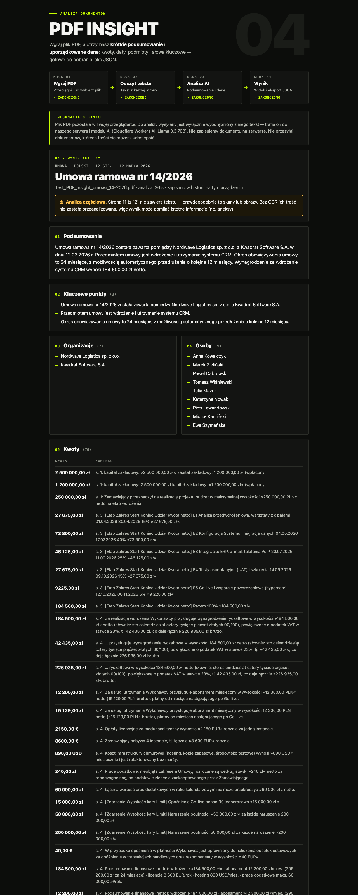

# PDF Insight

Upload a PDF, get a factual summary and structured data (document type, title, date, key points,
organizations, people, amounts, dates, keywords) as validated JSON you can download. Polish UI.

- **Demo:** https://iamkiryl.github.io/pdf-insight/ (intended to stay available for 14 days, until
  2026-10-20; availability on the Free plan is not guaranteed)
- **Repository:** https://github.com/iamKiryl/pdf-insight
- **Backend:** https://pdf-insight-api.pdf-insight-api.workers.dev (`/api/health`)
- **Last successful CI:** [run 37458017167](https://github.com/iamKiryl/pdf-insight/actions/runs/37458017167)
  (`a58e416`, all checks); Pages deployed by [run 37456785150](https://github.com/iamKiryl/pdf-insight/actions/runs/37456785150) (`1b1ddd7`)
- **Handoff summary (results, open requirements):** [docs/HANDOFF.md](docs/HANDOFF.md)



Screenshot: a fresh public analysis of the sample contract (run P, TypeScript Worker, 26.5 s,
before OCR existed — page 11 is reported as unanalysed). OCR screenshots use a synthetic scan with
one manual correction ([review](docs/screenshots/ocr-review-synthetic.png),
[accepted](docs/screenshots/ocr-ready-synthetic.png), [360 px offer](docs/screenshots/ocr-offer-mobile-synthetic.png)).
[History panel](docs/screenshots/public-demo-history.png) and [result reopened from history](docs/screenshots/public-demo-result-from-history.png)
come from the earlier Python backend; `desktop-*.png` / `mobile-*.png` from a local stub (no AI).

## Status in one paragraph

All MUST requirements are implemented and the public demo works, but **not reliably within the
30 s target**: two public analyses of the sample took 26.5 s and 30.7 s (the model call alone is
25–30 s). Each analysis used **37–39 ms Worker CPU, above the 10 ms documented for Workers
Free**. History (F-09) is done. OCR (F-10) is published as an optional browser step with manual
correction; **OCR text → AI analysis is not verified** (no AI call was made with OCR text).
**Long documents (F-08) are not done.** Details: [docs/STATUS.md](docs/STATUS.md).

## How it works

1. Drop or choose a PDF (≤ 10 MB). pdf.js extracts text page by page in the browser; the PDF never
   leaves the browser. Pages without a text layer are flagged.
2. Optional **OCR** (only on click, only for flagged pages): Tesseract.js (Polish + English) runs in
   a Web Worker in the browser; the user compares the recognised text with the page image, corrects
   it if needed and accepts it. Nothing is replaced automatically. OCR assets are served from this
   site; page images are never sent anywhere. See [docs/OCR.md](docs/OCR.md).
3. **Analizuj z AI** sends only the page texts (+ which pages are OCR text) to the Worker.
4. The result (summary, key points, entities, amounts and dates with source quotes, keywords,
   partial-analysis / OCR warnings) is validated with Zod, shown, downloadable as JSON and kept in
   **local history** (≤ 10 results in this browser, never the PDF or its text).

## Architecture (as deployed)

```
Browser (GitHub Pages, React 19 SPA)                Cloudflare Worker (TypeScript, Workers Free)
┌──────────────────────────────────────┐  HTTPS    ┌──────────────────────────────────────────────┐
│ PDF ≤10 MB stays in the browser      │  JSON:    │ CORS allowlist, body ≤256 KiB (streamed cap) │
│ pdf.js → text per page               │  pages,   │ Rate Limiting bindings (per IP + global)     │
│ optional OCR (Tesseract.js, review   │  missing  │ strict Zod request validation                │
│   and manual correction)             │  pages,   │ compact: code extracts amount/date           │
│ limits checked, nothing truncated    │  ocrPages │   candidates with source offsets             │
│ Zod validates every response         │ ────────► │ env.AI.run(Llama 3.3 70B, JSON schema):      │
│ result view, JSON download,          │ ◄──────── │   model selects candidate IDs + narrative    │
│ local history                        │  result   │ strict output checks, ≤1 correction call     │
└──────────────────────────────────────┘           └──────────────────────────────────────────────┘
```

- **frontend/** — React 19, Vite, TypeScript strict, Zod. `src/components` (UI), `src/lib`
  (contract, extraction, OCR, flow state, history), `src/api` (HTTP client).
- **worker/** — the **production backend**: TypeScript Cloudflare Worker, compact mode only. Uses the
  frontend's Zod result schema; prompt and golden fixtures generated from the Python reference.
  Bundle 1 080 KiB / 150 KiB gzip. See [worker/README.md](worker/README.md).
- **backend/** — Python (FastAPI/Pydantic) implementation: **reference and evaluation tooling**, not
  deployed (it was production until the TS Worker replaced it because of Free-plan CPU). Contains the
  evaluator, oracle and parity-fixture generator, plus the experimental `single` and `chunked` modes
  (chunked = unaccepted F-08 experiment, failed its only live trial).
- **contracts/** — limits, ISO code lists and accepted/rejected result fixtures shared by pytest and
  Vitest. Details: [contracts/README.md](contracts/README.md).

### Key decisions

| Topic | Decision |
|---|---|
| AI access | Workers AI **binding**; no model API key anywhere (code, config, browser, CI). |
| Model | `@cf/meta/llama-3.3-70b-instruct-fp8-fast`, `response_format: json_schema`. A Gemma 4 comparison failed one document (omitted a rejected bid) and was stopped. |
| Compact mode | Code finds every amount/date candidate with its exact source context; the model only selects IDs and writes the narrative; values and contexts are copied from the source. ≤ 30 000 characters, ≤ 400 candidates. |
| Untrusted input | Page text is wrapped in `<document>/<page>` tags with tag names neutralised; instructions inside the document are content. Results rendered as text only. |
| Ownership | `fileName`, `pages` and `analysis` come from the request, never from the model. |
| Validation | Strict model-output checks (unknown/wrong-kind IDs, types, marker leaks, people attested in the source), then the Zod result schema; exactly one correction call on invalid output; the browser never retries on its own. |
| Scans / OCR | Text-less pages listed in `analysis.pagesWithoutText` with a partial-analysis warning; accepted OCR text is sent with `ocrPages`, marked `source="ocr"` in the prompt and returned as `analysis.ocrPages` (warning on result, JSON, history). |
| Limits | Rate limits 5/60 s per IP and 30/60 s global (per Cloudflare location, approximate); fail closed without bindings. One model call ≤ 40 s, all calls ≤ 55 s, browser gives up at 65 s. |

## Local development

Prerequisites: Node 22+, [uv](https://docs.astral.sh/uv/) (Python 3.13+) for the reference backend.

```bash
# frontend (predev/prebuild copy the pinned OCR assets into public/ocr/)
cd frontend
npm ci
npm run dev                  # http://localhost:5173, API defaults to http://localhost:8787
npm run lint && npm run format:check && npm run typecheck && npm test && npm run build
```

```bash
# production backend (TypeScript Worker): checks without any Cloudflare account
cd worker
npm ci
npm run typecheck && npm test && npx wrangler deploy --dry-run --outdir dist
```

```bash
# run the TS Worker locally with the real Workers AI binding (needs `npx wrangler login` by a human;
# AI calls always go to Cloudflare and use the account's daily quota)
cd worker
npx wrangler dev --port 8787 --var ENVIRONMENT:development   # adds localhost origins
```

```bash
# Python reference: tests, lint, evaluator (no account needed)
cd backend
uv sync
uv run ruff check . && uv run ruff format --check . && uv run pytest -q
```

Configuration: `worker/wrangler.jsonc` vars (`ENVIRONMENT`, `ALLOWED_ORIGINS`, `MAX_BODY_BYTES`,
`AI_MODEL`, `AI_MODE=compact`, timeouts, `AI_MAX_TOKENS`); an unknown model or mode fails closed.
Frontend: `VITE_API_URL` (`frontend/.env.local` locally, GitHub repository variable for Pages). No
application secrets exist.

## Deployment

- Backend: `cd worker && npx wrangler deploy --config wrangler.jsonc` (Workers Free, same Worker name
  `pdf-insight-api`). Current version `7f5eed60-d76e-4595-9371-3c2de449c8b4`; exact rollback
  commands in [docs/RUNTIME.md](docs/RUNTIME.md). Deploy the Worker before a frontend that depends
  on a contract change; roll back the frontend first.
- Frontend: GitHub Actions `CI` (lint → typecheck/tests (frontend, Python, TS Worker) → build →
  Pages). Publishing runs only from **Actions → CI → Run workflow** with `deploy` checked. Base path
  `/pdf-insight/`. Current Pages build: `1b1ddd7`.
- Details and verification evidence: [docs/DEPLOYMENT.md](docs/DEPLOYMENT.md).

## Limitations

- **F-08 long documents: not done.** Text above 30 000 characters is rejected with an explicit
  message (never truncated); the chunked mode is an unaccepted Python experiment.
- **OCR → AI not verified:** the OCR flow and correction were checked locally and on the public site
  without AI; no analysis of OCR text by the model was run. OCR misreads (`§` → `$` creates false
  USD amounts, dropped headings, `o.o.` → `0.0.`) are only fixed if the user corrects them.
- **Time 26.5–30.7 s** for the 12-page sample on the public demo (target < 30 s not reliably met;
  one earlier run on the Python backend hit the 40 s timeout).
- **CPU 37–39 ms per analysis, above the 10 ms Workers Free limit** (non-AI requests 0–6 ms); no
  resource-limit error observed so far, but sustained overruns may be enforced. No paid plan.
- Workers AI daily free allocation is shared by all visitors (≈ 400 neurons per analysis); exhaustion
  is reported as `AI_QUOTA_EXCEEDED`.
- Tables are flattened row by row; two-column lines keep both values without saying which belongs to
  whom. The model selects many candidates, so amount lists are long.
- Tests and schema validation prove structure and behaviour, not semantic accuracy or sustained
  Free-plan availability; quality was checked on two documents with an AI-assisted review.

## Repository guide

- [docs/HANDOFF.md](docs/HANDOFF.md) — final state, requirement checklist, measurements, rollback.
- [docs/STATUS.md](docs/STATUS.md) — detailed status and dated checkpoints.
- [docs/LIVE_AI_RESULTS.md](docs/LIVE_AI_RESULTS.md) — every live AI run with evaluation.
- [docs/OCR.md](docs/OCR.md), [docs/RUNTIME.md](docs/RUNTIME.md), [docs/DEPLOYMENT.md](docs/DEPLOYMENT.md).
- [docs/PLAN.md](docs/PLAN.md) — requirements analysis and plan (Russian).
- [AI_LOG.md](AI_LOG.md) — how AI tools were used: prompts, actions, mistakes and fixes.
